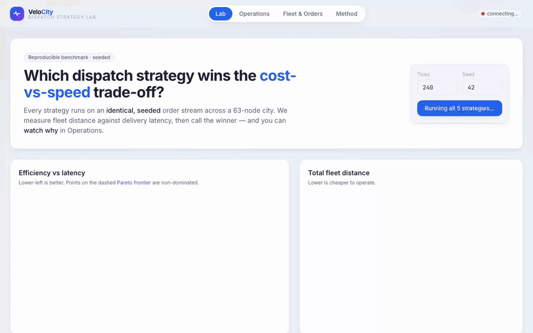
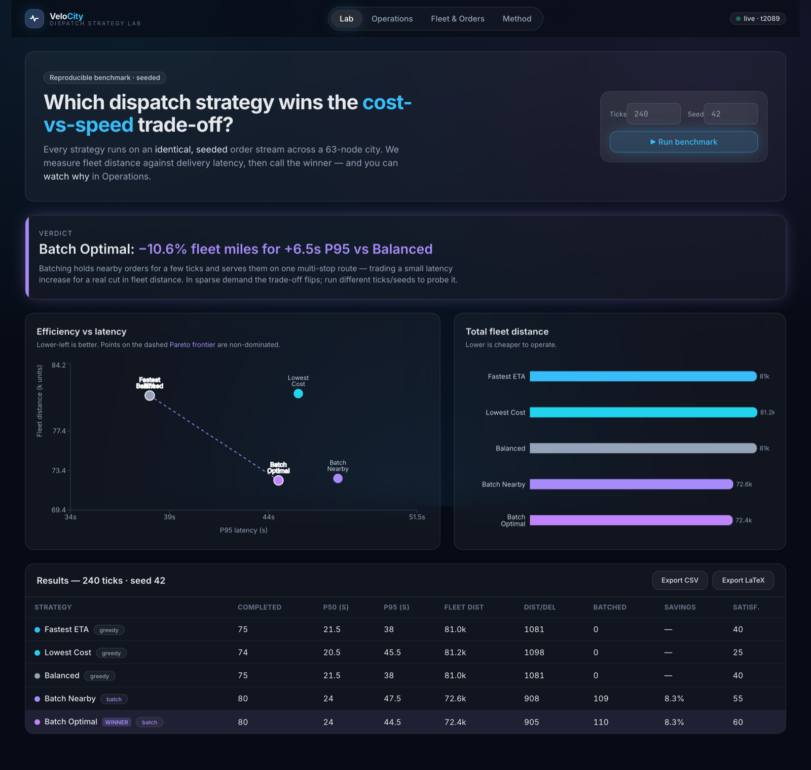
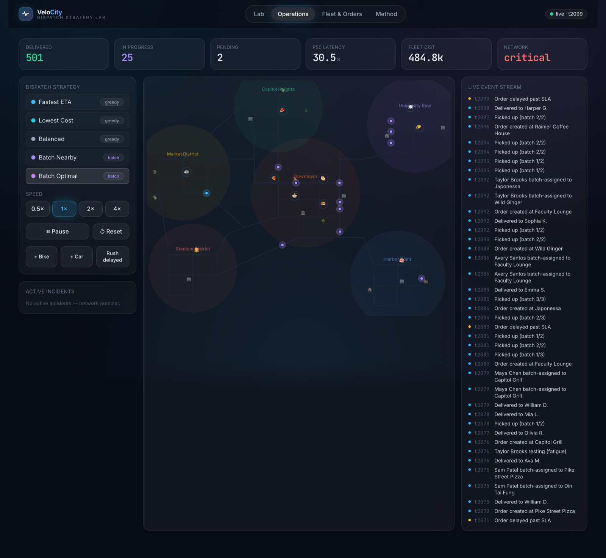
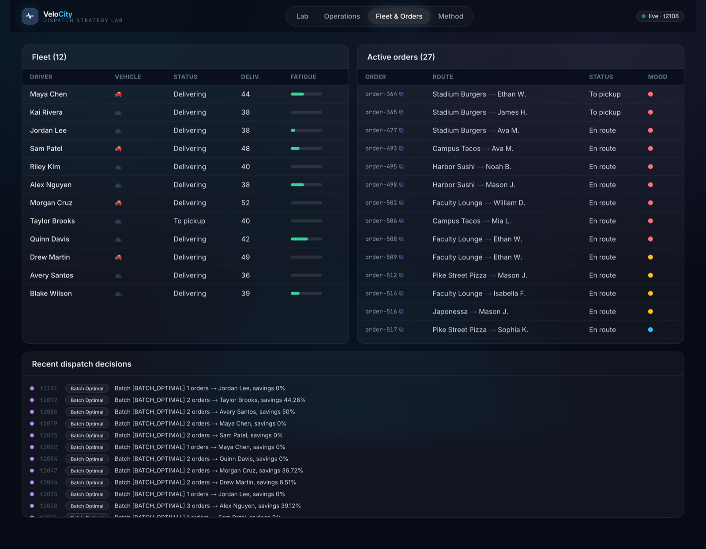
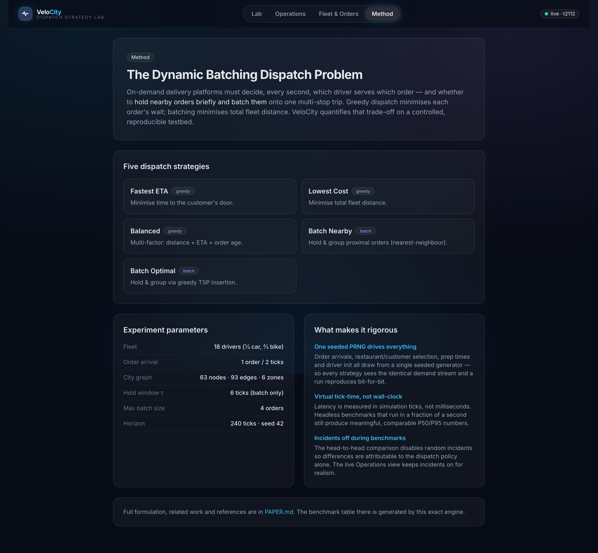

<div align="center">

# ⚡ VeloCity — Dispatch Strategy Lab

### Which dispatch strategy wins the cost-vs-speed trade-off in last-mile delivery?

VeloCity answers that question with **reproducible, seeded experiments** — and lets you
**watch why** on a live city map. It benchmarks five dispatch strategies (three greedy,
two order-batching) on an identical demand stream, calls the winner, and exports
publication-ready results. Under the hood: a dependency-free TypeScript simulation
engine (Dijkstra routing, spatial batching, greedy-TSP insertion) served live over
WebSocket to a dark **glass control-room** UI.

<br/>



<br/>


<sub>▶ Prefer video? Watch the <a href="docs/media/walkthrough.mp4">full walkthrough (MP4)</a>. Runs with one command — no Docker, no Kafka, no database.</sub>

</div>

---

## 🎯 The verdict

Running all five strategies on an identical, seeded order stream (240 ticks, seed 42,
dense-demand regime):

> **Batch Optimal: −10.6% fleet distance for +6.5 s P95 vs Balanced** — while completing
> *more* orders (80 vs 75) and lifting customer satisfaction (60 vs 40).

Batching holds spatially-proximal orders for a few ticks and serves them on one
multi-stop route. It trades a small latency increase for a real cut in fleet distance —
**when demand is dense enough to cluster**. In sparse demand the trade-off flips, which
you can reproduce live by lowering the arrival rate.

| Strategy | Completed | P50 (s) | P95 (s) | Fleet dist | dist/del | Batch% | Satisfaction |
|----------|:---------:|:-------:|:-------:|:----------:|:--------:|:------:|:------------:|
| Fastest ETA | 75 | 21.5 | 38.0 | 81,046 | 1,081 | 0% | 40 |
| Lowest Cost | 74 | 20.5 | 45.5 | 81,222 | 1,098 | 0% | 25 |
| Balanced | 75 | 21.5 | 38.0 | 81,046 | 1,081 | 0% | 40 |
| Batch Nearby | 80 | 24.0 | 47.5 | 72,648 | 908 | 91% | 55 |
| **Batch Optimal** ⭐ | **80** | 24.0 | **44.5** | **72,433** | **905** | 92% | **60** |

<sub>Reproduce verbatim: <code>npm run experiment -w server -- --ticks 240 --seed 42</code> · raw output in <a href="docs/benchmark.csv">docs/benchmark.csv</a></sub>

---

## 🖥️ Inside the control room

<table>
  <tr>
    <td width="50%"><p align="center"><sub><b>Lab</b> — verdict, efficiency-latency Pareto chart & results</sub></p></td>
    <td width="50%"><p align="center"><sub><b>Operations</b> — live city map, KPIs, strategy & speed controls</sub></p></td>
  </tr>
  <tr>
    <td width="50%"><p align="center"><sub><b>Fleet & Orders</b> — drivers, live orders, dispatch decisions</sub></p></td>
    <td width="50%"><p align="center"><sub><b>Method</b> — the problem, strategies & experiment design</sub></p></td>
  </tr>
</table>

---

## 🧠 How it works

1. **Authoritative simulation.** A single `SimulationEngine` owns all state — drivers,
   orders, incidents, traces. One `tick()` advances the world: generate orders, run
   dispatch, move drivers along Dijkstra routes, update SLAs, decay incidents.

2. **Five dispatch strategies.** Three greedy scorers (Fastest ETA, Lowest Cost, Balanced)
   assign each order to the best idle driver. Two batch strategies hold proximal orders in
   a queue, cluster them by restaurant proximity, and build a multi-stop route —
   **Batch Nearby** via nearest-neighbour, **Batch Optimal** via greedy cheapest-insertion TSP.

3. **Live view = the same engine.** The server runs the engine on a 500 ms loop and
   broadcasts a full snapshot over WebSocket each tick; the Next.js UI is a pure view layer.

4. **The Lab = the same engine, headless.** The benchmark spins up isolated, seeded engine
   instances and runs them as fast as the CPU allows — identical code path, reproducible results.

### Built for reproducibility

Two design choices make the benchmark trustworthy (and fix subtle traps in naïve simulators):

- **One seeded PRNG drives everything** — order arrivals, restaurant/customer choice, prep
  times, driver init. Same seed ⇒ bit-for-bit identical run, so metric differences are
  attributable to the dispatch policy alone.
- **Virtual tick-time, not wall-clock** — latency is measured in simulation ticks, so a
  headless run that finishes in milliseconds still yields meaningful, comparable P50/P95.

---

## 🏗️ Architecture

```
┌──────────────────────────┐    /api/*  (REST)     ┌───────────────────────────┐
│      Next.js 14 (web)    │ ────────────────────▶ │   Fastify + ws (server)   │
│  Lab · Operations ·      │                       │                           │
│  Fleet · Method          │ ◀──── /ws snapshot ── │   LiveSim (500ms loop)    │
│  Zustand · Recharts ·    │      (per tick)       │     └ @velocity/engine     │
│  framer-motion           │                       │        · Dijkstra          │
└──────────────────────────┘                       │        · 5 strategies      │
                                                    │        · batching / TSP    │
┌──────────────────────────┐   import (isomorphic) │        · event bus/traces  │
│   @velocity/engine (TS)  │ ◀──────────────────── │   ExperimentRunner ──▶ CSV │
│   pure, no deps          │                       │                    LaTeX   │
└──────────────────────────┘                       └───────────────────────────┘
```

The engine is a **dependency-free, isomorphic** TypeScript package shared by the server and
the browser. No Kafka/Redis/Postgres/Docker — event streaming, queue metrics and traces are
modeled as first-class in-process concepts, so the whole thing runs with one command.

---

## 🚀 Quick start

**Prerequisites:** Node.js 18+.

```bash
npm install          # installs all three workspaces
npm run dev          # starts the server (:8080) and web (:3000) together
```

Open **http://localhost:3000** — the Lab auto-runs a benchmark; Operations shows the live sim.

Run the headless benchmark on its own:

```bash
npm run experiment -w server -- --ticks 240 --seed 42 --out docs
```

---

## 🗂️ Project structure

```
velocity/
├── engine/                # @velocity/engine — pure, isomorphic TS simulation
│   └── src/
│       ├── engine.ts      # SimulationEngine (tick loop, seeded, tick-time)
│       ├── dispatch.ts    # 5 strategies · clustering · greedy-TSP insertion
│       ├── pathfinding.ts # Dijkstra over the road graph
│       ├── experiment.ts  # headless seeded runner + CSV/LaTeX export
│       ├── cityMap.ts     # graph loader + lookups
│       └── data/city-map.json  # 63 nodes · 93 edges · 6 zones
├── server/                # Fastify REST + WebSocket + live tick loop + experiment CLI
├── web/                   # Next.js dark glass control-room (Lab, Operations, Fleet, Method)
├── docs/                  # media, benchmark.csv/json/tex
├── PAPER.md               # full problem formulation, method & results
└── README.md
```

---

## 🔌 API

| Method | Endpoint | Description |
|--------|----------|-------------|
| `GET` | `/api/snapshot` | Full live simulation state |
| `POST` | `/api/simulation/pause \| resume \| reset` | Control the live sim |
| `PUT` | `/api/simulation/speed` · `/api/dispatch/strategy` | Set speed / strategy |
| `POST` | `/api/experiments/compare` | Run all 5 strategies → results + verdict |
| `GET` | `/api/experiments/export/csv \| latex` | Export benchmark tables |
| `WS` | `/ws` | Snapshot stream, one message per tick |

---

## 🧪 Tests

```bash
npm test    # engine: determinism, pathfinding, reproducible benchmarks
```

The suite asserts that identical seeds produce identical runs — the property the whole
benchmark rests on.

---

## 🛠️ Tech stack

**Engine** · TypeScript (zero runtime deps) · Dijkstra · greedy-TSP insertion
**Server** · Node · Fastify · ws · tsx
**Web** · Next.js 14 · TypeScript · Tailwind CSS · Zustand · Recharts · Framer Motion
**Tooling** · npm workspaces · Vitest · Playwright (media)

---

## 📄 Research

The full problem formulation (the Dynamic Batching Vehicle Dispatch Problem), related work,
method and results are in **[PAPER.md](PAPER.md)** — its results table is generated by this
exact engine.

---

<div align="center"><sub>MIT licensed. A study of online order batching in last-mile delivery, built to be run and reproduced.</sub></div>
